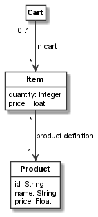

.. _first_class_model:

A first class model
*******************

Defining a class model
======================

In this and the next sections, we create a simple domain model for a shopping cart, items in the carts,
and products defining the items as a class model. Please note that the domain model in this and the next sections
are inspired by the model at:
`<https://www.uml-diagrams.org/examples/online-shopping-domain-uml-diagram-example.html>`_.
In Codeable Models a simple excerpt of such a model can be created with the following code::

    cart = CClass(domain_metaclass, "Cart")

    item = CClass(domain_metaclass, "Item", attributes={
        "quantity": int,
        "price": float
    })

    product = CClass(domain_metaclass, "Product", attributes={
        "id": str,
        "name": str,
        "price": float
    })

    cart_item_relation = cart.association(item, "in cart: [cart] 0..1 -> [item in cart] *")
    item_product_relation = item.association(product, "product: [cart item] * -> [product] 1")

In the model, we first define a class named ``Cart`` as an instance of the ``domain_metaclass``
meta-class and assign its Python object to ``cart``. This is done using :py:class:`.CClass`.
Next, we define two other classes ``Item``
and ``Product`` in the same way. They additionally have attributes, which are defined using an
``attributes`` dictionary. Both define various class attributes based on standard Python data
types such as ``int``, ``float``, or ``str``.

In the last two lines, we define two associations between the classes. The first one associates
a cart to items with role name ``cart`` for the ``Cart`` side of the association, and role name
``item in cart`` for the ``Item`` side of the association. The association has the label ``in cart``.
The cart side has the cardinality ``0..1`` whereas the items have the cardinality ``*``.

Likewise a second association from items to a product is defined with label ``product definition``,
role name ``cart item`` and cardinality ``*`` for the carts, and  role name ``product`` and
cardinality ``1`` for the product.

Imports
=======

In order to make the model above run, we need to import some elements from Codeable Models at the
beginning of the script::

    from codeable_models import CClass
    from metamodels.domain_metamodel import domain_metaclass

The first line imports :py:class:`.CClass` used for any kind of class definition, and the second line
imports ``domain_metaclass``, a common meta-class to be used in simple domain models such as the
one above. Most simple domain models do not need much more meta-modelling than this, as any
meta-model can reuse all Codeable Models class features such as associations, attributes,
inheritance, and so on.

Please note that alternatively we simply could have defined the meta-class like this::

    domain_metaclass = CMetaclass("Domain Class")

This statement creates a new meta-class (using :py:class:`.CMetaclass`)
with the name ``Domain Class``. It assigns the Python
object representing the meta-class to the variable ``domain_metaclass``. The same and some other
definitions are performed in the model ``metamodels.domain_metamodel``, which we import
(see also :ref:`domain_metamodel`).

Generating a UML class model visualization
==========================================

Next lets do something useful with our coded model. Codeable Models comes with renderers for
class and object models based on PlantUML. Here, we want to use the class model renderer to generate a
UML visualization of the model above. For this we need to define the subset of the model we
want to render. This is necessary as most models are much larger than three classes, and visualizations
usually should present digestible views of the whole model. This can be done by defining a
group of classes that should get rendered. Groups of classes can be defined using :py:class:`.CBundle`.
Here, in this small model, we want to define a bundle containing all classes, which can be done by
selecting any of the classes defined above and call ``get_connected_elements()`` on it::

    shopping_model = CBundle("shopping_model", elements=cart.get_connected_elements())

Finally, we need to instantiate the Plant UML generator and generate a class model using it::

    generator = PlantUMLGenerator()
    generator.generate_class_models("shopping_model", [shopping_model, {}])

Please note that we pass the bundle as a list followed by an empty dictionary, as usually we
may want to render more than one class model view at once (thus the list), and to some of
those views we may want to pass configuration parameters (which would be done in the dictionary).

Finally, we need to import ``CBundle`` and ``PlantUMLGenerator``, too. The resulting complete script is::

    from codeable_models import CClass, CBundle
    from plant_uml_renderer import PlantUMLGenerator
    from metamodels.domain_metamodel import domain_metaclass

    cart = CClass(domain_metaclass, "Cart")

    item = CClass(domain_metaclass, "Item", attributes={
        "quantity": int,
        "price": float
    })

    product = CClass(domain_metaclass, "Product", attributes={
        "id": str,
        "name": str,
        "price": float
    })

    cart_item_relation = cart.association(item, "in cart: [cart] 0..1 -> [item in cart] *")
    item_product_relation = item.association(product, "product: [cart item] * -> [product] 1")

    shopping_model = CBundle("shopping_model", elements=cart.get_connected_elements())
    generator = PlantUMLGenerator()
    generator.generate_class_models("shopping_model", [shopping_model, {}])

This script will generate the following UML class model:

The full code of the example in this tutorial can be found in the sample :ref:`shopping_model1`.

