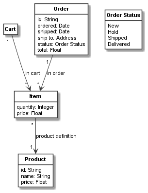

.. _class_attributes:

Class attributes
****************

Defining attributes
===================

Each class can have attributes of various types (for a full list of supported
attribute types see :py:class:`.CClassifier`).
We have already seen examples of ``int``, ``float``, and ``str`` attributes in the previous example::

    item = CClass(domain_metaclass, "Item", attributes={
        "quantity": int,
        "price": float
    })

    product = CClass(domain_metaclass, "Product", attributes={
        "id": str,
        "name": str,
        "price": float
    })

Instead of using types in the ``attributes`` dictionary, we could also use default values from which the types are
guessed. For instance, if we like for products to have an empty ``name`` string as default and offer them per default
for free (i.e. the price is 0.0), we could define ``Product`` as follows::

    product = CClass(domain_metaclass, "Product", attributes={
        "id": str,
        "name": "",
        "price": 0.0
    })

Introspecting attributes
========================
The attributes above are defined using the ``attributes`` setter property of :py:class:`.CClassifier`, invoked
by a keyword argument. With the
corresponding getter, we can get a list of all attributes of a classifier. For example, to get all product attributes,
we can invoke ``product.attributes``. This getter will return a list of objects of the type :py:class:`.CAttribute`.
Using :py:class:`.CAttribute` we can introspect all details of an attribute::

    print('Product Attributes:')
    for attribute in product.attributes:
        print('- "%s": type "%s", classifier "%s", default "%s"' % (attribute.name, attribute.type,
              attribute.classifier, attribute.default))

This would print the following result:

.. code-block:: none

    Product Attributes:
    - "id": type "<class 'str'>", classifier "Product", default "None"
    - "name": type "<class 'str'>", classifier "Product", default ""
    - "price": type "<class 'float'>", classifier "Product", default "0.0"

Instead of getting the attribute objects, it is also possible to get the names of all attributes only, using the
``attribute_names`` property of :py:class:`.CAttribute`. For example, the following code lists all
product attribute names::

    print('Product Attributes: %s' % product.attribute_names)

This prints the following result:

.. code-block:: none

    Product Attributes: ['id', 'name', 'price']

Individual attributes can be inspected with ``get_attribute``. The method returns the attribute's
:py:class:`.CAttribute` object and can thus be used to inspect the attribute, e.g. as follows::

    print('Default for price attribute = %s' % product.get_attribute("price").default)

This prints:

.. code-block:: none

    Default for price attribute = 0.0

Object and enumeration attributes
=================================
In addition to basic types, attributes can have object or enumeration types.

Enumeration are defined using :py:class:`.CEnum` with strings as possible enumeration values. For example, an order status
enumeration can be defined as follows::

    order_status = CEnum("Order Status", values=["New", "Hold", "Shipped", "Delivered"])

Lets further consider we want to use two basic data objects for defining ``Date`` and ``Address`` properties::

    date = CClass(domain_metaclass, "Date", attributes={
        "day": int,
        "month": int,
        "year": int
    })

    address = CClass(domain_metaclass, "Address", attributes={
        "street1": str,
        "street2": str,
        "zip": str,
        "city": str,
        "state": str,
        "country": str
    })

With this we can define an ``Order`` class that uses dates, an address, and the order status::

    order = CClass(domain_metaclass, "Order", attributes={
        "id": str,
        "ordered": date,
        "shipped": date,
        "ship to": address,
        "status": order_status,
        "total": float
    })

    order_item_relation = order.association(item, "in order: [order] 1 -> [item in order] *")

Again, instead of the types we could use objects and enum values as defaults. For objects this is simple. For example,
consider we have defined an object ``today`` always set to the today's date (before importing the
Python module containing ``order``) , e.g. like this::

    today = CObject(date, "today", values={
        "day": 1,
        "month": 5,
        "year": 20
    })

Then we could use ``today`` instead of ``date`` as the default value for the ``ordered`` attribute (not for ``shipped``
as it is not clear, if the order will be ship on the same day as it is ordered).

For enumeration objects we need to use
:py:class:`.CAttribute` with type and default value, as the enumeration values are strings, and thus just
using an enumeration value such as ``"New"`` as a default value would be ambiguous, as it could not be
distinguished from the string ``"New"``. Both object and enumeration default values are used below::

    order = CClass(domain_metaclass, "Order", attributes={
        "number": str,
        "ordered": today,
        "shipped": date,
        "ship to": address,
        "status": CAttribute(type=order_status, default="New"),
        "total": float
    })

Resulting model
===============

We can use the the Plant UML renderer to draw the resulting model like this::

    shopping_model = CBundle("shopping_model2", elements=(cart.get_connected_elements() +
                                                          [order_status]))
    generator = PlantUMLGenerator()
    generator.generate_class_models("shopping_model2", [shopping_model, {}])

This script will generate the following UML class model:

The full code of the examples in this tutorial can be found in the sample  :ref:`shopping_model2`.

