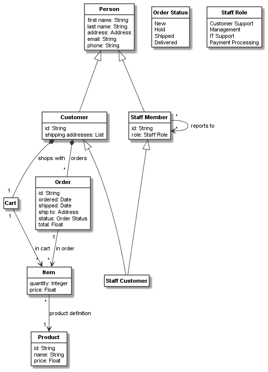
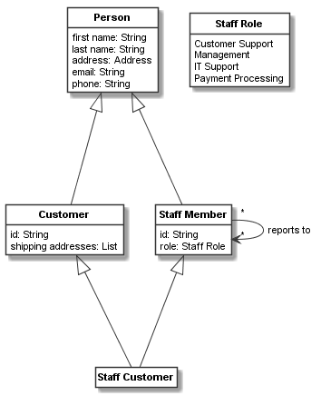
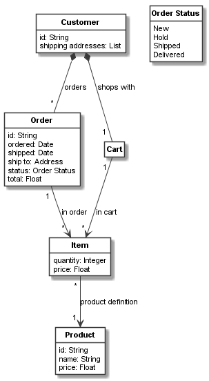

.. _class_relationships:

Class relationships: associations and inheritance
*************************************************

Defining associations
=====================

Associations have been introduced in the previous examples implicitly. Lets discuss them in a bit more detail.
They are defined on one of the classes which are associated with each other.
For example one of the previously defined associations was::

    order_item_relation = order.association(item, "in order: [order] 1 -> [item in order] *")

Here, class ``order`` is associated to class ``item``. As explained in the documentation of :py:class:`.CAssociation`,
either keyword arguments or the shorter association descriptor string (with the syntax explained in
:py:class:`.CAssociation`) can be used. That is, the following definition is equivalent to the one above::

    order_item_relation = order.association(item, name="in order", role_name="item in order",
                                            multiplicity="*", source_role_name="order",
                                            source_multiplicity="1")

The method ``association`` defined on :py:class:`.CClassifier` is used here to define the association. Equivalently,
the constructor of :py:class:`.CAssociation` can be used, for example the following also works::

    order_item_relation = CAssociation(order, item, "in order: [order] 1 -> [item in order] *")

All those ways to define an association return an object of type :py:class:`.CAssociation` that can be used
as a handle for the association. We can use this handle to change the association, e.g. add a
stereotype to it, or use it for defining links.

Introspecting associations
==========================

As associations are mainly used on links and classifiers, both :py:class:`.CLink` and :py:class:`.CClassifier`
offer ways to introspect the association(s) used on
them. See the examples on objects and links, or the documentations of :py:class:`.CLink` and :py:class:`.CObject`,
for more on links and their associations. Here, we focus on introspecting associations on :py:class:`.CClassifier`
(and its sub-classes).

From any classifier we can use the two getter properties ``associations`` or ``all_associations`` for either
listing the associations of the classifier or  listing all associations of the classifier including those
of superclasses, respectively. Both return a list of :py:class:`.CAssociation` objects.

For example, the following prints source and target via the :py:class:`.CAssociation` objects for each
association defined on the ``order`` class::

    for association in order.associations:
        print(f"SOURCE = {association.source!s} -> TARGET = {association.target!s}")

The following result will be printed:

.. code-block:: none

    SOURCE = Order -> TARGET = Item
    SOURCE = Customer -> TARGET = Order

Suppose we want to get a list of all classes linked to ``order``. Then it might be unhandy that ``order`` is sometimes
source and sometimes target of the association. Here, ``get_opposite_classifier()`` can help::

    print("Classes associated to order:")
    for association in order.associations:
        print(f"- {association.get_opposite_classifier(order)!s}")

This would print:

.. code-block:: none

    Classes associated to order:
    - Item
    - Customer

Inheritance definition
======================

Codeable models supports single and multiple inheritance for all classifiers. An inheritance relation
is defined by passing either a classifier (for single inheritance) or a list of
classifiers (for single or multiple inheritance) to the
``superclasses`` method or keyword argument of the classifier.

For example, consider we want to support two kinds of persons in our system: customers and staff members. Both
share some common attributes defined on the class ``person``::

    person = CClass(domain_metaclass, "Person", attributes={
        "first name": str,
        "last name": str,
        "address": address,
        "email": str,
        "phone": str
    })

Now can define the ``Customer`` and ``Staff Member`` classes with their attributes and additional associations.
Please note that they are both derived from the ``person`` class via inheritance using the statement
``superclasses=person`` in the keyword arguments::

    customer = CClass(domain_metaclass, "Customer", superclasses=person, attributes={
        "id": str,
        "shipping addresses": [],
        "selected shipping address": 0
    })

    customer_cart_relation = customer.association(cart, "shops with: [customer] 1 <*>- [cart] 1")
    customer_orders_relation = customer.association(order, "orders: [customer] 1 <*>- [order] *")

    staff_role = CEnum("Staff Role", values=["Customer Support", "Management",
                                             "IT Support", "Payment Processing"])

    staff_member = CClass(domain_metaclass, "Staff Member", superclasses=person, attributes={
        "id": str,
        "role": staff_role,
    })
    staff_reports_to_relation = staff_member.association(staff_member,
                                                         "reports to: [managed] * -> [manager] *")

Please further note that using a list with a single element (i.e., ``superclasses=[person]``) is equivalent to
the inheritance definition above. ``superclasses`` can also be called outside the keyword arguments, e.g. like this,
with the same effect::

    customer = CClass(domain_metaclass, "Customer", attributes={
        "id": str,
        "shipping addresses": [],
    })
    customer.superclasses=person

Finally, lets consider we also want to support that some staff members may be customers, too. This can be supported with
multiple inheritance like this::

    staff_customer = CClass(domain_metaclass, "Staff Customer",
                            superclasses=[staff_member, customer])

Codeable Models uses a linearized class path to unambiguously determine the resolution of classifier features in
the inheritance hierarchy. See the documentation of ``class_path`` on :py:class:`.CClassifier` for more information.

Introspecting inheritance
=========================

:py:class:`.CClassifier` offers various methods to introspect inheritance relationships, namely:

    - ``superclasses``:
        Returns the superclasses of a classifier
    - ``subclasses``:
        Returns the subclasses of a classifier
    - ``all_superclasses``:
        Returns all superclasses of a classifier on the inheritance hierarchy.
    - ``all_subclasses``:
        Returns all subclasses of a classifier on the inheritance hierarchy.
    - ``is_classifier_of_type(classifier)``:
        Checks if a classifier conforms to the provided ``classifier``'s type.
    - ``has_subclass(classifier)``:
        Returns ``True`` if ``classifier`` is subclass of this classifier, else ``False``.
    - ``has_superclass(classifier)``:
        Returns ``True`` if ``classifier`` is superclass of this classifier, else ``False``.
    - ``class_path``:
        Returns the linear resolution order of a classifier.

Here are some examples of using these methods and properties on ``staff_customer``::

    print("Direct superclasses of Staff Customer? " +
          f"{[c.name for c in staff_customer.superclasses]!s}")
    print("All superclasses of Staff Customer? " +
          f"{[c.name for c in staff_customer.all_superclasses]!s}")
    print("Is Staff Customer of type Person? " +
          f"{staff_customer.is_classifier_of_type(person)!s}")
    print("Is Staff Customer of type Staff Customer? " +
          f"{staff_customer.is_classifier_of_type(staff_customer)!s}")
    print("Has Staff Customer superclass Person? " +
          f"{staff_customer.has_superclass(person)!s}")
    print("Has Staff Customer superclass Staff Customer? " +
          f"{staff_customer.has_superclass(staff_customer)!s}")
    print("What is the class path of Staff Customer? " +
          f"{[c.name for c in staff_customer.class_path]!s}")

This would print:

.. code-block:: none

    Direct superclasses of Staff Customer? ['Staff Member', 'Customer']
    All superclasses of Staff Customer? ['Person', 'Staff Member', 'Customer']
    Is Staff Customer of type Person? True
    Is Staff Customer of type Staff Customer? True
    Has Staff Customer superclass Person? True
    Has Staff Customer superclass Staff Customer? False
    What is the class path of Staff Customer? ['Staff Customer', 'Staff Member', 'Person', 'Customer']

Resulting model
===============

We can use the the Plant UML renderer to draw the resulting model, like we did before. The result would be:

At this stage, we might feel that this model is growing too large to be depicted in a single view. We could
thus create views for the persons and the order management parts of our model. This can be done by just listing
all classes to be included in the bundle, as done for the persons view in the code below.
Or we can use the stop elements feature of ``get_connected_elements()`` to delimit the bundle
elements, as done for the orders view::

    shopping_model_all = CBundle("shopping_model3_all", elements=(cart.get_connected_elements() +
                                                                  [order_status, staff_role]))
    shopping_model_persons = CBundle("shopping_model3_persons",
                                     elements=[person, customer, staff_member, staff_customer,
                                               staff_role])
    shopping_model_orders = CBundle("shopping_model3_orders",
                                    elements=(order.get_connected_elements(
                                              stop_elements_inclusive=[customer]) +
                                              [order_status]))
    generator = PlantUMLGenerator()
    generator.generate_class_models("shopping_model3", [shopping_model_all, {},
                                                        shopping_model_persons, {},
                                                        shopping_model_orders, {}])

This creates the following persons view:

It also creates the following orders view:

The full code of the examples in this tutorial can be found in the sample :ref:`shopping_model3`.

