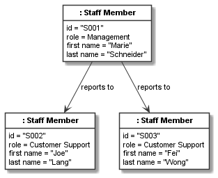
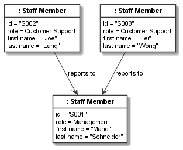
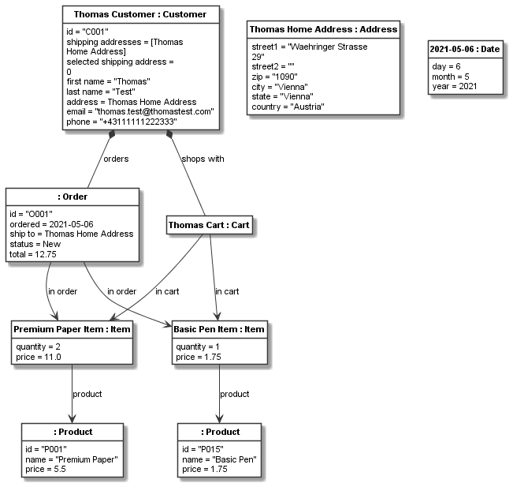

.. _first_object_model:

A first object model
********************

Defining objects
================

Objects are defined using :py:class:`.CObject`. An object always needs a class. It can have a name or not.
For example, we can define an ``address`` and a ``customer`` object based on the previously defined class model
as follows::

    thomas_home_address = CObject(address, "Thomas Home Address", values={
        "street1": "Waehringer Strasse 29",
        "street2": "",
        "zip": "1090",
        "city": "Vienna",
        "state": "Vienna",
        "country": "Austria"
    })

    thomas_customer = CObject(customer, "Thomas Customer", values={
        "id": "C001",
        "first name": "Thomas",
        "last name": "Test",
        "address": thomas_home_address,
        "email": "thomas.test@thomastest.com",
        "phone": "+43111111222333",
        "shipping addresses": [thomas_home_address]
    })

The ``values`` keyword argument is used to define values which are only accepted, if they conform
to the class' attributes (i.e., name and type must match). The address only contains
string attribute values, whereas the customer
has string values, but also the ``address`` value which accepts a :py:class:`.CObject` of type ``address``, as well as
the ``shipping address`` which accepts a ``list`` of address objects.

To provide a few more examples,
lets define a few unnamed product objects and a named shopping cart object::

    basic_pen = CObject(product, values={"id": "P001", "name": "Basic Pen", "price": 1.50})
    premium_pen = CObject(product, values={"id": "P001", "name": "Premium Pen", "price": 2.50})
    basic_paper = CObject(product, values={"id": "P001", "name": "Basic Paper", "price": 2.75})
    premium_paper = CObject(product, values={"id": "P001", "name": "Premium Paper", "price": 5.50})

    cart1 = CObject(cart, "Thomas Cart")

Object links
============
To link the cart to its customer and place the products in the shopping cart, we need to link
the objects. Objects can be linked if the respective classes have an association.
When linking objects, the association definitions are checked for correctness.
For example, trying to link three objects to another object based on a 1:1 multiplicity association,
yields an exception.

To link the cart to the customer, we need to add a link between them::

    cart1.add_links(thomas_customer)

This link is based on the association ``customer_cart_relation`` defined before. Because there is only one
association between cart and customer in our object model, Codeable Models can guess the correct
association based on the object types. Alternatively, we could provide the association and/or role name to select the
correct association and/or association direction unambiguously. Lets use those two specification
methods when linking items to their products::

    item1 = CObject(item, "Premium Paper Item", values={
        "quantity": 2,
        "price": 11.00
    })
    item1.add_links(premium_paper, association=item_product_relation)
    item2 = CObject(item, "Basic Pen Item", values={
        "quantity": 1,
        "price": 1.50
    })
    item2.add_links(basic_pen, role_name="product")

Here we have defined two items with their values and then linked them to their products, once by specifying
the association and once using the role name. In such simple models, using association and role
name specifications is often not needed, as the type information alone is enough to guess the correct
association. But once models get more complex and evolve,
it makes sense to always specify at least one of them, to ensure
that adding a new class association in the class model does not break depending object models.

The first argument of ``add_links`` can either be a single object or a list. A list is needed for defining links
to more than one object.

``add_links`` on :py:class:`.CObject` actually is a wrapper for the :py:func:`.add_links` function, which takes a dict
of multiple link specifications. With it multiple links can be specified at once. It also supports
association and role name specifications. If those are used, only one kind of link can be specified with one
:py:func:`.add_links` call. For example, we can use this function to define the links between items and the cart::

    add_links({cart1: [item1, item2]}, role_name="item in cart")

As a last example, lets define an order object along with links to its customer and the items in the order::

    order1 = CObject(order, values={
        "id": "O001",
        "ship to": thomas_home_address,
        "total": 12.50
    })
    order1.add_links(thomas_customer, association=customer_orders_relation)
    order1.add_links([item1, item2], association=order_item_relation)

Recursive relations
===================

The association ``staff_reports_to_relation`` is a recursive relation from the class ``staff_member`` to
itself. Consider we define a number of staff members::

    manager = CObject(staff_member, values={
        "id": "S001",
        "first name": "Marie",
        "last name": "Schneider",
        "role": "Manager"
    })
    crm1 = CObject(staff_member, values={
        "id": "S002",
        "first name": "Joe",
        "last name": "Lang",
        "role": "CRM"
    })
    crm2 = CObject(staff_member, values={
        "id": "S003",
        "first name": "Fei",
        "last name": "Wong",
        "role": "CRM"
    })

Here, we need to be careful: If we just use the association for specifying the links,
the direction of link specification and association might be identical or not. For example, the following code::

    add_links({manager: [crm1, crm2]}, association=staff_reports_to_relation)

would lead to the following model, which is not the indented link direction:

This can be corrected by specifying the links in the correct order given by the association,
which can be tedious to look up every time a link is specified and is thus error prone.
This issue can be avoid by using the role name for recursive associations which is unambiguous if two
different role names have been specified for the recursive association::

    add_links({manager: [crm1, crm2]}, role_name="managed")

This yields a correct staff model:

Getting and setting values
==========================

The ``values`` property can get and set the values of an object using the same kind of dict structure used for setting
values via the ``values`` keyword argument. For example, the following statement gets
all values of the basic pen product::

    print("Values of basic pen: %s" % basic_pen.values)

This would print:

.. code-block:: none

    Values of basic pen: {'name': 'Basic Pen', 'price': 1.5, 'id': 'P001'}

With the ``values`` setter we can set multiple values at once::

    basic_pen.values = {'price': 1.75, 'id': 'P001A'}

We can now inspect the new values::

    print("New values of basic pen: %s" % basic_pen.values)

This would print:

.. code-block:: none

    New values of basic pen: {'name': 'Basic Pen', 'price': 1.75, 'id': 'P001A'}

We can get single values with ``get_value()`` and set single values with ``set_value()``. For example, after the price
change on the product, we might want to update prices in ``NEW`` orders and their items. For our model, we could
do this using::

    print(f"Old basic pen item price: {item2.get_value('price')!s}, " +
          f"old order total: {order1.get_value('total')!s}")
    item2.set_value("price", 1.75)
    order1.set_value("total", 12.75)
    print(f"New basic pen price: {item2.get_value('price')!s}, " +
          f"new order total: {order1.get_value('total')!s}")

This would print:

.. code-block:: none

    Old basic pen item price: 1.5, old order total: 12.5
    New basic pen price: 1.75, new order total: 12.75

Introspecting links
===================
A simple way to introspect links is to get the linked :py:class:`.CObject`
instances. This can be done with the ``linked`` property or the ``get_linked()`` method. For example, the following::

    for linked in item2.linked:
        print(repr(linked))

would print something like:

.. code-block:: none

    <codeable_models.cobject.CObject object at 0x000001BC7FAC12C8>
    <codeable_models.cobject.CObject object at 0x000001BC7FAC1C08>: Thomas Cart
    <codeable_models.cobject.CObject object at 0x000001BC7FAC6488>

Please note that we used ``repr()`` instead of ``str()`` here, as ``item2`` can be linked to order, product, and
cart objects. As the order and product objects in our model have no name, their string representation is empty.

For linked objects it is often useful to use ``get_linked(**kwargs)`` where the ``kwargs`` can be used to
specify which kinds of linked objects should be returned. Analogous to the link definitions above, we can use
the ``role_name`` and ``association``
keyword arguments to filter the links. If for example we want all items linked to ``order1`` we can use::

    for linked in order1.get_linked(association=order_item_relation):
        print(f"Order Item: {linked!s}")

This would print:

.. code-block:: none

    Order Item: Premium Paper Item
    Order Item: Basic Pen Item

Each link is represented internally using a :py:class:`.CLink` object. With the link object we can get more information
than just the linked :py:class:`.CObject`.
For example, we can find out which source and target objects are used in a link, or on which
association it is based. We can also change the link, e.g. set a ``label`` on it.
We can get all links (i.e. :py:class:`.CLink` objects) of an object using the
``links`` property. For example, the links of ``item2`` can be printed using::

    for link in item2.links:
        print(str(link))

This will print:

.. code-block:: none

    `CLink source = Basic Pen Item -> target = `
    `CLink source = Thomas Cart -> target = Basic Pen Item`
    `CLink source =  -> target = Basic Pen Item`

The string representation of :py:class:`.CLink` is quite usable for objects with a name.
But same as for linked objects above, if unnamed objects are
used, as in our case, using ``repr`` might be more helpful::

    for link in item2.links:
        print(repr(link))

This will print something like:

.. code-block:: none

    `CLink <codeable_models.clink.CLink object at 0x0000017A13615488> source = <codeable_models.cobject.CObject object at 0x0000017A13611FC8>: Basic Pen Item -> target = <codeable_models.cobject.CObject object at 0x0000017A13611208>`
    `CLink <codeable_models.clink.CLink object at 0x0000017A13615808> source = <codeable_models.cobject.CObject object at 0x0000017A13611B48>: Thomas Cart -> target = <codeable_models.cobject.CObject object at 0x0000017A13611FC8>: Basic Pen Item`
    `CLink <codeable_models.clink.CLink object at 0x0000017A13615D88> source = <codeable_models.cobject.CObject object at 0x0000017A13615388> -> target = <codeable_models.cobject.CObject object at 0x0000017A13611FC8>: Basic Pen Item`

To get a fully readable representation of the links, in case of unnamed objects, we might better
print some attribute values of the source and target objects, stored in :py:class:`.CLink`, that identify them.
For example, above the order source and the product target
do not have a name. With ``instance_of()`` we can find out whether an object is
an instance of :py:class:`.CClass` ``order`` or ``target`` and in those cases
use other attribute values to identify them::

    for link in item2.links:
        source_str = str(link.source)
        if link.source.instance_of(order):
            source_str = "Order " + link.source.get_value("id")
        target_str = str(link.target)
        if link.target.instance_of(product):
            target_str = "Product " + link.target.get_value("name")
        print(f"Link: {source_str} -> {target_str}")

This would print:

.. code-block:: none

    Link: Basic Pen Item -> Product Basic Pen
    Link: Thomas Cart -> Basic Pen Item
    Link: Order O001 -> Basic Pen Item

Sometimes we only want the links of a specific association, e.g. only the links from an order to its items, but
no other links defined for the order. This can be achieved with ``get_links_for_association(association)``::

    for link in order1.get_links_for_association(order_item_relation):
        print(f"Link: Order {link.source.get_value('id')} -> {link.target!s}")

This would print:

.. code-block:: none

    Link: Order O001 -> Premium Paper Item
    Link: Order O001 -> Basic Pen Item

Resulting model
===============

We can use the the Plant UML renderer to draw the resulting model. The result would be:

Please note that here we must use the object model renderer, not the class model renderer
to generate the models. It is called via the ``generate_object_models()``
method and otherwise used in the same way as the class model renderer used before.

This image and the staff image above have been rendered using the following code::

    shopping_instance1_order_model = CBundle("shopping_instance1_order_model",
                                             elements=order1.get_connected_elements() +
                                                      [thomas_home_address, today])
    shopping_instance1_staff_model = CBundle("shopping_instance1_staff_model",
                                             elements=manager.get_connected_elements())

    generator = PlantUMLGenerator()
    generator.generate_object_models("shopping_instance1",
                                     [shopping_instance1_order_model,
                                      {"render_association_names_when_no_label_is_given": True},
                                      shopping_instance1_staff_model,
                                      {"render_association_names_when_no_label_is_given": True}])

Links can have optional ``label`` specifications, to support specifying a link-specific label.
In addition to that, it
can be useful to turn the rendering option ``render_association_names_when_no_label_is_given`` on. It adds the
association labels to links that have no label (done for all figures in this chapter). This can be a useful
option, if the meaning of the link arrows might be unclear.

The full code of the examples in this tutorial can be found in the sample  :ref:`shopping_instances1`.