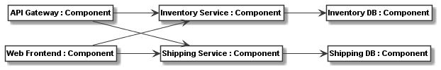
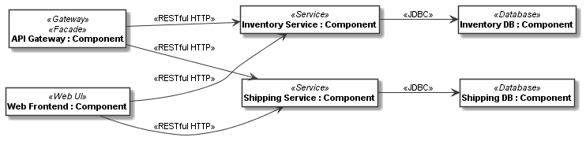
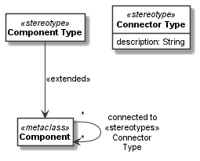

.. _meta_model_stereotypes:

A meta-model with stereotypes
*****************************

The need for stereotypes in meta-models
=======================================

Stereotypes provide a way for extending existing meta-classes and meta-class associations. They can be seen as
additional, orthogonal classifications or types for the classifiers derived from the
meta-classes and meta-class associations.

To illustrate this, let us consider a very simple definition of a component and connector meta-model. We just define
a metaclass for components and use associations to represent the connectors::

    component = CMetaclass("Component")
    connectors_relation = component.association(component, "connected to: [source] * -> [target] *")

With this minimal meta-model, we can define meaningful component models, such as the following. It models
two services each with a database per service, as well as an API gateway and a Web frontend accessing the
services::

    api_gateway = CClass(component, "API Gateway")
    inventory_service = CClass(component, "Inventory Service")
    shipping_service = CClass(component, "Shipping Service")
    web_frontend = CClass(component, "Web Frontend")
    inventory_db = CClass(component, "Inventory DB")
    shipping_db = CClass(component, "Shipping DB")

    add_links({api_gateway: [inventory_service, shipping_service],
               web_frontend: [inventory_service, shipping_service],
               inventory_service: inventory_db,
               shipping_service: shipping_db},
              role_name="target")

Here is the model rendered as an meta-class instance model:

To make the model more meaningful and also to be able to automatically process it, be it for analysis or
code generation, we might need a bit more information about the components and connectors. For example, we might
want to distinguish service, database, Web, and gateway components. The obvious way to do this is subclassing::

    service = CMetaclass("Service", superclasses=component)
    gateway = CMetaclass("Gateway", superclasses=component)
    web_ui = CMetaclass("Web UI", superclasses=component)
    database = CMetaclass("Database", superclasses=component)

While this is good and fine for many tasks, it has the disadvantage that users of the metamodel cannot easily extend
the components with their own types anymore. Consider for example we also want to model which
type of access control a component uses, such as API keys, an authentification protocol, or no access control.
Further, as a third notion, for each component we want to be able to model,
whether it is a Facade for a sub-system or not. With multiple inheritance we could do this,
but we would need to derive all possible combinations of meta-classes, as exemplified below for
three of the many possible combinations::

    facade_service_with_api_keys = CMetaclass("Facade Service with API Keys", superclasses=[service, facade, api_keys])
    service_with_api_keys = CMetaclass("Service with API Keys", superclasses=[service, api_keys])
    facade_api_gateway_no_access_control = CMetaclass("Facade Gateway / No Access Control",
                                                      superclasses=[facade, gateway])
    ...

Deriving all possible combinations would lead to a combinatorial explosion of classes.

In addition, associations might need multiple classifications, too. For instance, in our example
we might want to specify the type of the connector, such as a Restful HTTP or JDBC connector.
Extending associations as done above would be more tricky.

The full code of the examples in this first part of this tutorial can be found in the
sample :ref:`microservice_component_model1`.

Using stereotypes in meta-models
================================

The problems outlined in the previous section can be avoided by using stereotypes for various kinds of orthogonal
classifications and other extensions. :py:class:`.CStereotype` is used for defining stereotypes. They can be
added to a meta-class using the ``extended`` property of :py:class:`.CStereotype` or using the ``stereotypes`` property
of :py:class:`.CMetaclass`.

For example, lets realize the component and connector types from the examples above plus the orthogonal
extension that some components can be facades. Web UIs are always facade components, other services and gateways may
or may not be facades. This can be modelled with the following stereotype extensions to our meta-model above::

    service = CStereotype("Service", extended=component)
    database = CStereotype("Database", extended=component)

    facade = CStereotype("Facade", extended=component)
    web_ui = CStereotype("Web UI", superclasses=facade)
    gateway = CStereotype("Gateway", extended=component)

    jdbc = CStereotype("JDBC", extended=connectors_relation)
    restful_http = CStereotype("RESTful HTTP", extended=connectors_relation)

Below you can see the meta-model with extensions rendered:

.. thumbnail:: images/component_meta_model.png

Please note that the UML Profile Extension relation notation (a filled triangle arrowhead pointing from a stereotype
to the extended metaclass) is not supported by Plant UML yet. We have thus decided to render the extension relation
of meta-classes using an ``extended`` stereotype on the extension relation. As in our models typically the
association is not shown as a meta-class, we put a ``stereotypes`` stereotype on the label of the association that
is extended.

Stereotype instances
====================

To use stereotypes in a class model, the ``stereotype_instances`` property of the class or of the class link
shall be used. It accepts a single or a list of stereotypes. Any :py:class:`.CStereotype` extending the
meta-class can be defined on classes derived from
that meta-class as a stereotype instance.  Any :py:class:`.CStereotype` extending a
meta-class association can be defined on a class link derived from that association as a stereotype instance.
That is, the list of stereotypes on the meta-class or meta-class association (or on their superclasses)
defines the possible stereotypes instances of a class or class link.

With the meta-model extension above, we can define the class model as follows::

    api_gateway = CClass(component, "API Gateway", stereotype_instances=[gateway, facade])
    inventory_service = CClass(component, "Inventory Service", stereotype_instances=service)
    shipping_service = CClass(component, "Shipping Service", stereotype_instances=service)
    web_frontend = CClass(component, "Web Frontend", stereotype_instances=web_ui)
    inventory_db = CClass(component, "Inventory DB", stereotype_instances=database)
    shipping_db = CClass(component, "Shipping DB", stereotype_instances=database)

    add_links({api_gateway: [inventory_service, shipping_service],
               web_frontend: [inventory_service, shipping_service]},
              role_name="target", stereotype_instances=restful_http)

    add_links({inventory_service: inventory_db, shipping_service: shipping_db},
              role_name="target", stereotype_instances=jdbc)

Here is the model rendered as an instance model:

Using stereotype superclasses for extensions
============================================

In this example, all stereotypes extend the meta-classes and meta-class associations directly. In our own work,
we usually introduce a superclass for each kind of stereotype to better organize meta-models.

For example, the meta-model in the Codeable Models distribution in folder ``metamodels/component_metamodel.py``
extends the component and connector meta-classes with a component type and connector type stereotype::

    component = CMetaclass("Component")
    component_type = CStereotype("Component Type", extended=component)

    connectors_relation = component.association(component, "connected to: [source] * -> [target] *")
    connector_type = CStereotype("Connector Type", extended=connectors_relation,
                                 attributes={"description": str})

Here is the Plant UML visualization of this model:

Specific component models can now extend the types by subclassing them and/or add orthogonal extensions in separate
stereotype hierarchies. For example the :ref:`microservice_components_metamodel` for modelling
microservice component models, at the time of this writing had the following component types defined:

.. thumbnail:: images/Component_Stereotypes.png

It defines also the following connector types:

.. thumbnail:: images/Connector_Stereotypes.png

The full code of the examples for this part of the tutorial can be found in the
sample :ref:`microservice_component_model2`.

Tagged values
=============

As in UML, stereotypes can introduce new attributes only valid for stereotyped instances. Those are called
tagged values on the instances, i.e. classes or class links. Tagged values can simply be defined as ``attributes``
on the stereotype. For example, we might want to extend components which are services with host name and port values::

    service = CStereotype("Service", extended=component, attributes={
        "host_name": str,
        "port": int
    })

We might further want to extend the ``restful_http`` connector with an attribute to select, if it is an HTTP or HTTPS
connection::

    http_protocol = CEnum("HTTP Protocol", values=["HTTP", "HTTPS"])
    restful_http = CStereotype("RESTful HTTP", extended=connectors_relation, attributes={
        "protocol": CAttribute(type=http_protocol, default="HTTPS"),
    })

The property ``tagged_values`` and the methods ``get_tagged_value()``, ``set_tagged_value()``,
and ``delete_tagged_value()`` can be used on any class or class link that has one of those stereotypes
as a stereotype instance. Those properties and methods work exactly like the respective
ordinary operations on ``values``.

For example, lets consider we want to set host name and port of the shipping services::

    shipping_service.set_tagged_value("host_name", "www.example.com")
    shipping_service.set_tagged_value("port", 80)

We can print out the result of this change as follows::

    print(f'shipping service is running on {shipping_service.get_tagged_value("host_name")!s} ' +
          f'and port {shipping_service.get_tagged_value("port")!s}')

The result is:

.. code-block:: none

    shipping service is running on www.example.com and port 80

Consider we want to change the link between shipping service and zip code service to HTTP. Then we need to
call ``set_tagged_value()`` on the class link object::

    print(f"old protocol shipping service to zip code: " +
          f"{shipping_service_zip_code_service_link.get_tagged_value('protocol')}")
    shipping_service_zip_code_service_link.set_tagged_value('protocol', "HTTP")
    print(f"new protocol shipping service to zip code: " +
          f"{shipping_service_zip_code_service_link.get_tagged_value('protocol')}")

Here we also print the old and the new tagged value, which yields the following result:

.. code-block:: none

    old protocol shipping service to zip code: HTTPS
    new protocol shipping service to zip code: HTTP

Default values on stereotypes
=============================

Consider we want to build our system from distributed components. For example, for the purpose of
for selecting the proper code generation and deployment tasks in our tool chain,  it shall be modeled,
whether these components are mock components or not, and whether they are stateless or not.
This can be modelled using a special component class with those attributes::

    distributed_component = CMetaclass("Distributed Component", superclasses=component,
                                       attributes={
                                            "stateless": False,
                                            "mock": False
                                        })

Assuming that the distributed component classes in the class model are
derived from this meta-class, we could derive a
stateless service stereotype from ``service`` as a subclass. Here, it is undesirable that the default value
for the ``stateless`` attribute is ``False`` for such stereotyped ``stateless`` components of which we know
that they are stateless. With the ``default_values`` dict, a stereotype can redefine default values of the
extended meta-class::

    stateless_service = CStereotype("Service", extended=distributed_component, superclasses=service,
                                    default_values={"stateless": True})

Please note that we must specify that ``distributed_component`` is extended, in order
to redefine a default value of it, as the default value is unknown
for the superclass ``component`` which ``service`` extends. Of course, alternatively,
this can also be done by letting ``service`` extend ``distributed component`` in the first place like this::

    service = CStereotype("Service", extended=distributed_component)
    stateless_service = CStereotype("Service", superclasses=service,
                                    default_values={"stateless": True})

Now consider we model the components and connectors like this::

    api_gateway = CClass(distributed_component, "API Gateway", stereotype_instances=[gateway, facade])
    zip_code_service = CClass(distributed_component, "Zip Code Service", stereotype_instances=stateless_service)
    inventory_service = CClass(distributed_component, "Inventory Service", stereotype_instances=service)
    shipping_service = CClass(distributed_component, "Shipping Service", stereotype_instances=service)
    web_frontend = CClass(distributed_component, "Web Frontend", stereotype_instances=web_ui)
    inventory_db = CClass(distributed_component, "Inventory DB", stereotype_instances=database)
    shipping_db = CClass(distributed_component, "Shipping DB", stereotype_instances=database)

    add_links({api_gateway: [inventory_service, shipping_service, zip_code_service],
               web_frontend: [inventory_service, shipping_service],
               shipping_service: zip_code_service},
              role_name="target", stereotype_instances=restful_http)

    add_links({inventory_service: inventory_db, shipping_service: shipping_db},
              role_name="target", stereotype_instances=jdbc)

If we now access the attribute values of the stateless service, it has the changed value ``True`` for ``stateless``
whereas other services still have ``False`` as a value, e.g.::

    print(f"inventory service values = {inventory_service.values!s}")
    print(f"zip code service values = {zip_code_service.values!s}")

This prints:

.. code-block:: none

    inventory service values = {'stateless': False, 'mock': False}
    zip code service values = {'stateless': True, 'mock': False}

Stereotype introspection
=========================

A meta-class or association can be queried for its stereotypes using the ``stereotypes`` property. For example,
we could print the stereotypes of the ``component`` and ``connector_relation`` meta-classes::

    print(f"component stereotypes = {component.stereotypes!s}")
    print(f"connector stereotypes = {connectors_relation.stereotypes!s}")

This would print something like:

.. code-block:: none

    component stereotypes = [<codeable_models.cstereotype.CStereotype object at 0x00000229793B8608>: Component Type, <codeable_models.cstereotype.CStereotype object at 0x000002297945A708>: Service, <codeable_models.cstereotype.CStereotype object at 0x000002297945AE88>: Database, <codeable_models.cstereotype.CStereotype object at 0x000002297945E0C8>: Facade, <codeable_models.cstereotype.CStereotype object at 0x000002297945E208>: Gateway]
    connector stereotypes = [<codeable_models.cstereotype.CStereotype object at 0x00000229793B8C88>: Connector Type, <codeable_models.cstereotype.CStereotype object at 0x000002297945E548>: JDBC, <codeable_models.cstereotype.CStereotype object at 0x0000022979464DC8>: RESTful HTTP]

In addition, ``get_stereotypes(name)`` can find all stereotypes with a given name, and
``get_stereotype(name)`` the first stereotype with a name, respectively.

On the stereotype we can introspect the same relation using the ``extended`` property returning all extended
meta-classes or associations. For example, we could print this information for two of the stereotypes::

    print(f"facade extended = {facade.extended!s}")
    print(f"restful_http extended = {restful_http.extended!s}")

This would print something like:

.. code-block:: none

    facade extended = [<codeable_models.cmetaclass.CMetaclass object at 0x000001F4E8C27448>: Component]
    restful_http extended = [CAssociation name = connected to, source = Component -> target = Component]

Stereotype instance introspection
=================================

With the ``stereotype_instances`` property we can get the stereotype instances defined on a class or link. For example,
we can print the stereotype instances for one of the database classes and one of the Restful HTTP links::

    print(f"Shipping DB stereotype instances: {shipping_db.stereotype_instances!s}")
    print(f"Shipping service to zip code link stereotype instances: " +
          f"{shipping_service_zip_code_service_link.stereotype_instances!s}")

This would print something like:

.. code-block:: none

    Shipping DB stereotype instances: [<codeable_models.cstereotype.CStereotype object at 0x00000242DFABAF08>: Database]
    Shipping service to zip code link stereotype instances: [<codeable_models.cstereotype.CStereotype object at 0x00000242DFAC4E48>: RESTful HTTP]

The extended instances of a stereotype can be introspected with ``extended_instances``. It gets the
extended instances, i.e. the classes or class links extended by the stereotype. ``all_extended_instances``
is a getter to get all the extended instances, i.e. the classes or class links
extended by a stereotype, including those on subclasses. For example, we can print extended instances
for a few stereotypes::

    print(f"extended instances of database: {database.extended_instances!s}")
    print(f"all extended instances of component: {service.extended_instances!s}")
    print(f"extended instances of restful_http: {restful_http.extended_instances!s}")

This would print something like:

.. code-block:: none

    extended instances of database: [<codeable_models.cclass.CClass object at 0x0000024285F83FC8>: Inventory DB, <codeable_models.cclass.CClass object at 0x0000024285F83E08>: Shipping DB]
    all extended instances of component: [<codeable_models.cclass.CClass object at 0x0000024285F80E08>: Inventory Service, <codeable_models.cclass.CClass object at 0x0000024285F83908>: Shipping Service]
    extended instances of restful_http: [`CLink <codeable_models.clink.CLink object at 0x0000024285F86908> source = <codeable_models.cobject.CObject object at 0x0000024285F83508>: Shipping Service -> target = <codeable_models.cobject.CObject object at 0x0000024285F80AC8>: Zip Code Service`, `CLink <codeable_models.clink.CLink object at 0x0000024285F86B48> source = <codeable_models.cobject.CObject object at 0x0000024285F800C8>: API Gateway -> target = <codeable_models.cobject.CObject object at 0x0000024285F835C8>: Inventory Service`, `CLink <codeable_models.clink.CLink object at 0x0000024285F86C88> source = <codeable_models.cobject.CObject object at 0x0000024285F800C8>: API Gateway -> target = <codeable_models.cobject.CObject object at 0x0000024285F83508>: Shipping Service`, `CLink <codeable_models.clink.CLink object at 0x0000024285F86B08> source = <codeable_models.cobject.CObject object at 0x0000024285F800C8>: API Gateway -> target = <codeable_models.cobject.CObject object at 0x0000024285F80AC8>: Zip Code Service`, `CLink <codeable_models.clink.CLink object at 0x0000024285F86E88> source = <codeable_models.cobject.CObject object at 0x0000024285F834C8>: Web Frontend -> target = <codeable_models.cobject.CObject object at 0x0000024285F835C8>: Inventory Service`, `CLink <codeable_models.clink.CLink object at 0x0000024285F86F48> source = <codeable_models.cobject.CObject object at 0x0000024285F834C8>: Web Frontend -> target = <codeable_models.cobject.CObject object at 0x0000024285F83508>: Shipping Service`]

The full code of the examples for last part of the tutorial can be found in the
sample :ref:`microservice_component_model3`.