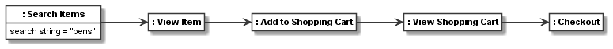

.. _combining_object_class_and_meta_class_modelling:

Combining object, class, and meta-class model
*********************************************

Many models are defined as class models. Sometimes object models are derived from class models.
In other cases, only a meta-model is defined. In some of these cases
a class model is derived from it, and used only as an instance model of the
meta-model, as in the previous meta-modelling examples. For modelling tasks, where a class and
instance level need to be combined, the decision to model
with class and object models  or meta-class and class instance models
depends on the nature of the modelling task at hand.
It also depends on available modelling means. For example, if stereotype instances are needed at the instance level,
a meta-model needs to be used at the class level.

In some cases, we want to model at all three levels. That is, we derive a meaningful class instance level from a
meta-model, but also use class features such as class association, inheritance, and attributes at the class
model level, to be used in a derived object model.

Let us consider such an example. We will base this on the previously introduced shopping activity and shopping cart
class models. The :ref:`activity_metamodel` was used as a meta-model for the shopping activity class model.
Consider the shopping activity class model describe a workflow. Then instances of the workflow would be individual
workflow traces of one customer performing a shopping session. Such as session would create objects of the types used
in our shopping cart class model.

To enable this, firstly, we define a superclass for all classes used in our class model, and
give it the ability to define workflow traces that describe the linear steps take in
one workflow run (i.e., 1:1 relations between nodes)::

    workflow_node = CClass(activity_node, "Workflow Node")
    workflow_trace = workflow_node.association(workflow_node, "next: 1 [from] -> 1 [to]")

Next, to easily extend the previously defined activity class model, we first define how some of the nodes
in the workflow can link to the elements of the shopping cart domain models by defining classes for viewing a product,
viewing a cart, accessing an orders, and creating an item. Further, for each of those, we define a relation from
the workflow node to the respective shopping cart model element::

    view_product_node = CClass(activity_node, "View Product", superclasses=workflow_node)
    view_product_node.association(product, "product: * -> [product] 1")
    view_cart_node = CClass(activity_node, "View Cart", superclasses=workflow_node)
    view_product_node.association(cart, "cart: * -> [cart] 1", superclasses=workflow_node)
    access_order_node = CClass(activity_node, "Access Order", superclasses=workflow_node)
    access_order_node.association(order, "order: * -> [order] 1", superclasses=workflow_node)
    create_item_node = CClass(activity_node, "Create Item", superclasses=workflow_node)
    create_item_node.association(item, "item: * -> [item] 1", superclasses=workflow_node)

Now we change all of the activity classes in our previous activity model to be subclasses of the workflow class,
so that they can have traces. Also, we use the special workflow node classes defined above, to give some of
the activities the ability to link to objects from the shopping cart model. Finally, we give the search
item activity node a ``search string`` attribute::

    initial_node_shopping_cart = CClass(initial_node, superclasses=workflow_node)
    decision_node_search_browse = CClass(decision_node, superclasses=workflow_node)
    merge_node_search = CClass(merge_node, superclasses=workflow_node)
    search_item = CClass(activity_node, "Search Items", superclasses=workflow_node, attributes={
        "search string": str
    })
    merge_node_browse = CClass(merge_node, superclasses=workflow_node)
    browse_item = CClass(activity_node, "Browse Items", superclasses=workflow_node)
    decision_node_found = CClass(decision_node, values={"decision": "Item found?"}, superclasses=workflow_node)
    merge_node_view_item = CClass(merge_node, superclasses=workflow_node)
    view_item = CClass(activity_node, "View Item", superclasses=view_product_node)
    decision_node_decision_made = CClass(decision_node, values={"decision": "Decision made?"}, superclasses=workflow_node)
    add_to_shopping_cart = CClass(activity_node, "Add to Shopping Cart", superclasses=create_item_node)
    decision_node_proceed = CClass(decision_node, superclasses=workflow_node)
    merge_node_view_shopping_cart = CClass(merge_node, superclasses=workflow_node)
    view_shopping_cart = CClass(activity_node, "View Shopping Cart", superclasses=view_product_node)
    decision_node_done = CClass(decision_node, superclasses=workflow_node)
    update_shopping_cart = CClass(activity_node, "Update Shopping Cart", superclasses=workflow_node)
    checkout = CClass(activity_node, "Checkout", superclasses=access_order_node)
    final_node_shopping_cart = CClass(final_node, superclasses=workflow_node)
    checkout_merge_node = CClass(merge_node, superclasses=workflow_node)
    check_shopping_cart = CClass(accept_event_action, "Check Shopping Cart", superclasses=workflow_node)
    proceed_to_checkout = CClass(accept_event_action, "Proceed to Checkout", superclasses=workflow_node)

Please note that those activity classes have the same links as defined in :ref:`meta_modelling` (not shown here).

Lets define a small helper function to create a trace from a list of nodes::

    def create_trace(node_list):
        trace = []
        for node in node_list:
            if node.classifier.name is not None:
                trace.append(node)
        for i in range(0, len(trace) - 1):
            trace[i].add_links(trace[i + 1], role_name="to")
        return trace

A trace is a recording of all nodes used during a shopping session in linear order. A trace would likely be
recorded by a shopping application, e.g. in its log files. Thus it would contain all nodes (also control nodes)
that have been used. In the function above, we filter out the control nodes to
only use the meaningful user activities in our trace model. In addition, a shopping session would produce objects
such as a cart, items, and an order. As we do not have a shopping application in which we can record such a trace,
we manually code the trace and the orders created during a shopping session, in which one product is searched,
viewed, added to a shopping cart, and then bought::

    # define a new cart and order, as they would be created in the shopping session
    cart1 = CObject(cart)
    cart1_items = add_items_to_cart(cart1, [[premium_pen, 3]])
    set_links({cart1: thomas_customer}, association=customer_cart_relation)
    order1 = place_order(cart1)

    # create and link the objects which have attributes or links
    search_obj = CObject(search_item)
    search_obj.set_value("search string", "pens")
    view_shopping_cart_obj = CObject(view_shopping_cart)
    view_shopping_cart_obj.add_links(cart1, role_name="cart")
    add_to_shopping_cart_obj = CObject(add_to_shopping_cart)
    add_to_shopping_cart_obj.add_links(cart1_items, role_name="item")
    checkout_obj = CObject(checkout)
    checkout_obj.add_links(order1, role_name="order")
    view_item_obj = CObject(view_item)
    view_item_obj.add_links(premium_pen, role_name="product")

    # pass the full trace to create_trace to filter out the meaningful objects in the trace and link them
    a_trace = create_trace([CObject(initial_node_shopping_cart),
                            CObject(decision_node_search_browse),
                            CObject(merge_node_search),
                            search_obj,
                            CObject(decision_node_found),
                            CObject(merge_node_view_item),
                            view_item_obj,
                            CObject(decision_node_decision_made),
                            add_to_shopping_cart_obj,
                            CObject(decision_node_proceed),
                            CObject(merge_node_view_shopping_cart),
                            view_shopping_cart_obj,
                            CObject(decision_node_done),
                            CObject(checkout_merge_node),
                            checkout_obj,
                            CObject(final_node_shopping_cart)])

As a result, we get the following workflow trace model:

We can also render the trace with the linked shopping cart model objects:

.. thumbnail:: images/shopping_trace_object_model_with_objects.png

Finally, the resulting class model for the workflow nodes together with linked nodes (leaving out the unnamed
control activity node classes) is the following:

.. thumbnail:: images/workflow_class_model.png

These images have been rendered using the following code::

    named_classes_in_workflow_class_model = [c for c in workflow_node.get_connected_elements() if c.name is not None]
    workflow_class_model = CBundle("workflow_class_model",
                                   elements=named_classes_in_workflow_class_model)

    shopping_trace_object_model = CBundle("shopping_trace_object_model",
                                          elements=a_trace)
    shopping_trace_object_model_with_objects = CBundle("shopping_trace_object_model_with_objects",
                                                       elements=a_trace[0].get_connected_elements())
    generator = PlantUMLGenerator()
    generator.generate_class_models("workflow_class_model", [workflow_class_model, {}])
    generator.object_model_renderer.left_to_right = True
    generator.generate_object_models("shopping_trace_object_model", [shopping_trace_object_model, {},
                                                                     shopping_trace_object_model_with_objects, {}])

The full code of the examples in this tutorial can be found in the sample :ref:`shopping_activity_model2`.